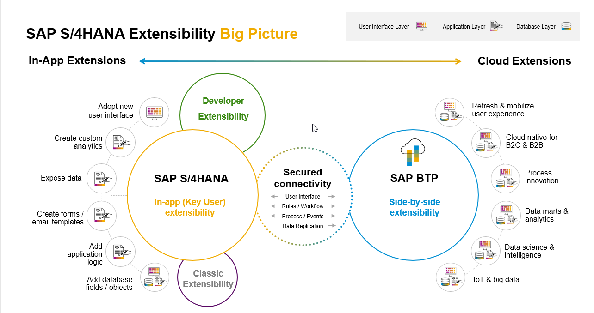
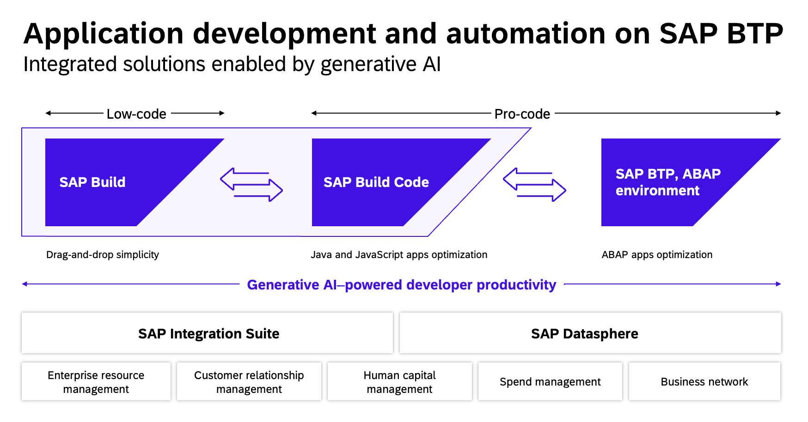
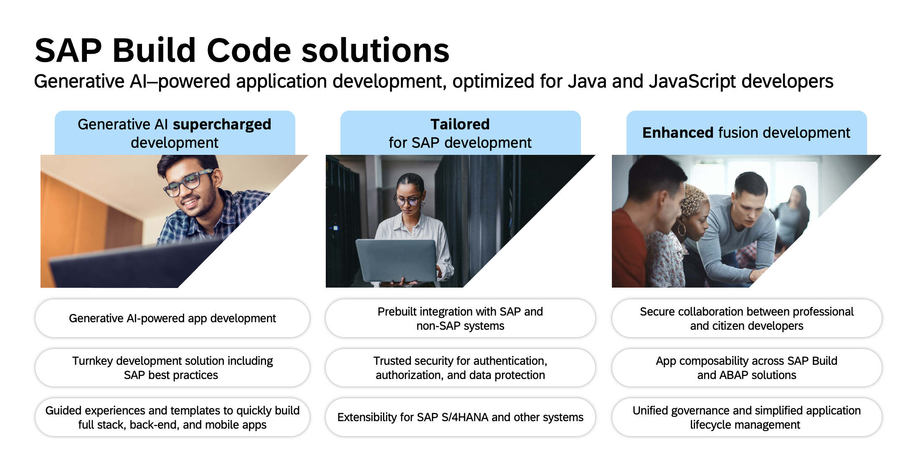

# AD267 - Extending with ABAP Cloud and SAP Cloud Application Programming Model

## Description

This repository contains the material for the SAP TechEd 2023 session called AD267 - Extending with ABAP Cloud and SAP Cloud Application Programming Model.

## Overview

### The Clean Core Strategy
SAP advocates keeping your Core Clean by using the various Extensibility Options given below in the diagram.
We shall make use of Developer Extensibility and Side-by-Side extensibility and show how easy it is to communicate between both worlds in this hands-on exercise.

### SAP Build Code

Last year, SAP launched SAP Build to empower business experts to construct applications, implement automations and compose business sites. This year, the Build family is being expanded to offer a powerful shortcut for cloud application development with the introduction of SAP Build Code.

SAP Build Code unifies essential application development tools such as SAP Business Application Studio, SAP Cloud Application Programming Model (CAP), SAPUI5, SAP Mobile Services, and SAP Document Management Services. It is powered by the generative AI copilot, Joule, and enables interoperability with ABAP Cloud. Additionally, it facilitates seamless collaboration with SAP Build's low-code solutions and provides robust governance and lifecycle management features.

### Exercise Overview

In this hands-on session, we will create a new service using the ABAP RESTful Application Programming Model (RAP) in an on-premise SAP S/4HANA system. This RAP service will generate an event which will then be consumed in an application created by you using the Cloud Programming Model (CAP) on the SAP Business Technology Platform (BTP).

## Requirements

To carry out the exercises of this repository, you need to
- use ABAP Development Tools (ADT) for the ABAP development parts
- have a browser ready, preferably Google Chrome, to access SAP Build Code

The users for the development environment during the course are the User IDs that have been provided to you by the hosts.

Go to [Getting Started - Preparation](exercises/ex0/README.md) to find the installation details, and URLs, and then start with the first exercise.

### Business Scenario 

In this hands-on workshop, the scenario we will implement an online shop for employees which will allow creation of *Purchase Requisitions* by using a released RAP facade from Procurements.   
 
 - An existing customer/partner wants to create a new business application that will allow employees of a company to order certain articles such as laptops for quick delivery using this shopping app. Purchase Requisition created can be viewed/approved by the Approver through an Application on cloud. This can be realized with the ABAP RESTful Application Programming Model (RAP) and SAP Build Code. 
 
 - You’ll build an application starting from a database table using an ADT wizard that generates a starter project which contains all the needed development RAP artefacts that have to be implemented. The generated business service will be transactional, draft-enabled, and enriched with UI semantics for the generation of the Fiori elements app. This application will create a standard Purchase Requisition in S/4HANA On-Premise system

 - Next, you will move to SAP Business Technology Platform's Build Code. You will create a Project in SAP Build Apps lobby using "Productivity Tools" option in SAP Business application Studio. You will get a story board to create data model, consume external resources (event & external API) from S/4HANA On-premise, draft enabled service and finally an UI application. This application will consume "Purchase Requisition Create" event from S/4HANA OP system and persist/approve it in HANA cloud.

   
## Exercises

- [Getting Started - Preparation](exercises/ex0/README.md)
- [Part 1 - ABAP ](exercises/rap/README.md)
- [Part 2 - SAP Build Code](exercises/buildcode/exercises/ex1/README.md)
  
## How to obtain support

Support for the content in this repository is available during the actual time of the online session for which this content has been designed. Otherwise, you may request support bby creating a new issue via the [Issues](../../issues) tab.

## License
Copyright (c) 2023 SAP SE or an SAP affiliate company. All rights reserved. This project is licensed under the Apache Software License, version 2.0 except as noted otherwise in the [LICENSE](LICENSES/Apache-2.0.txt) file.
