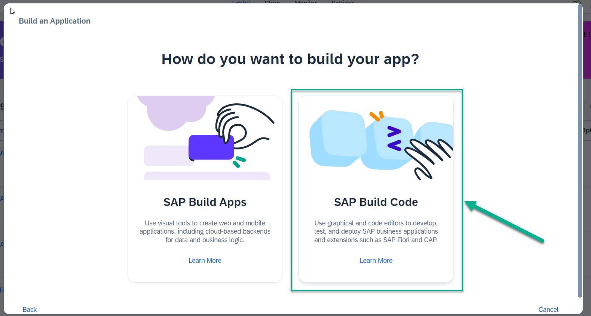

# Exercise 1: Create an Application to consume OnlineShop Purchase Requisition event and update the status of Purchase Requisition in Buildcode

From this exercise on, we will switch to SAP's Business Technology Platform (BTP).

In this exercise we will consume the event created in OnlineShop app in S/4HANA from the previous chapter. Broadly there will be two main steps:
- Consume an S/4HANA On-Premise event for Purchase Requisition Create and persist the data in HANA cloud
- Add an external API(S/4HANA OP) to read Purchase Requisition data in BTP

To create such a scenario we need to do the following:
1. [Create a project in SAP Build Lobby](exercises/buildcode/exercises/ex1/README.md)
2. [Create data model for purchase requisition for local persistence and add an external API association ](../../../buildcode/exercises/ex2/README.md)
3. [Create Service](../../../buildcode/exercises/ex3/README.md)[add and consume an event from S/4HANA On-Premise](../../../buildcode/exercises/ex4/README.md)
4. [Add and consume an event from S/4HANA On-Premise](../../../buildcode/exercises/ex4/README.md)
5. [Create UI application](../../../buildcode/exercises/ex5/README.md)
6. [Preview and test the app](../../../buildcode/exercises/ex6/README.md)

# Create a new Project in the SAP Build Lobby
Hint: Please use Google Chrome or Microsoft Edge to follow the exercises
[SAP Build Lobby](https://lcapteched.eu10.build.cloud.sap/lobby)
1. Open the SAP Build Lobby and login with the provided user-id and password.

2. In the SAP Build Lobby choose the button Create to start

3. A new window opens asking you what you would like to do. Select Build an Application.

4. You are asked which type of application you would like to build. Select SAP Build Code.

5. On the next step, choose Full Stack Application 

6. Add a Project Name, Namespace, Service Name, and a Short Description. Please name the project *'ManagePurchaseRequisitionXXX'* and replace XXX with the 3-digit number as given in the user-id that you used for login. Do not change the recommended dev space name.
> Note: Make sure you copy the project name without any spelling mistakes and only replace XXX with the 3-digit username. If the name is changed, you might run into issues in the remaining exercise.

> Note: The dev space recommended for you, may be a different from the one in the example. That's OK,  you can proceed.

7. It will take some time until your project is created. Once the project is created, you will see it listed in the Lobby. Click on the name of the project to open SAP Business Application Studio.

   

Continue to - **[Build Exercise 2: Create Data Model](../../../buildcode/exercises/ex2/README.md)**

