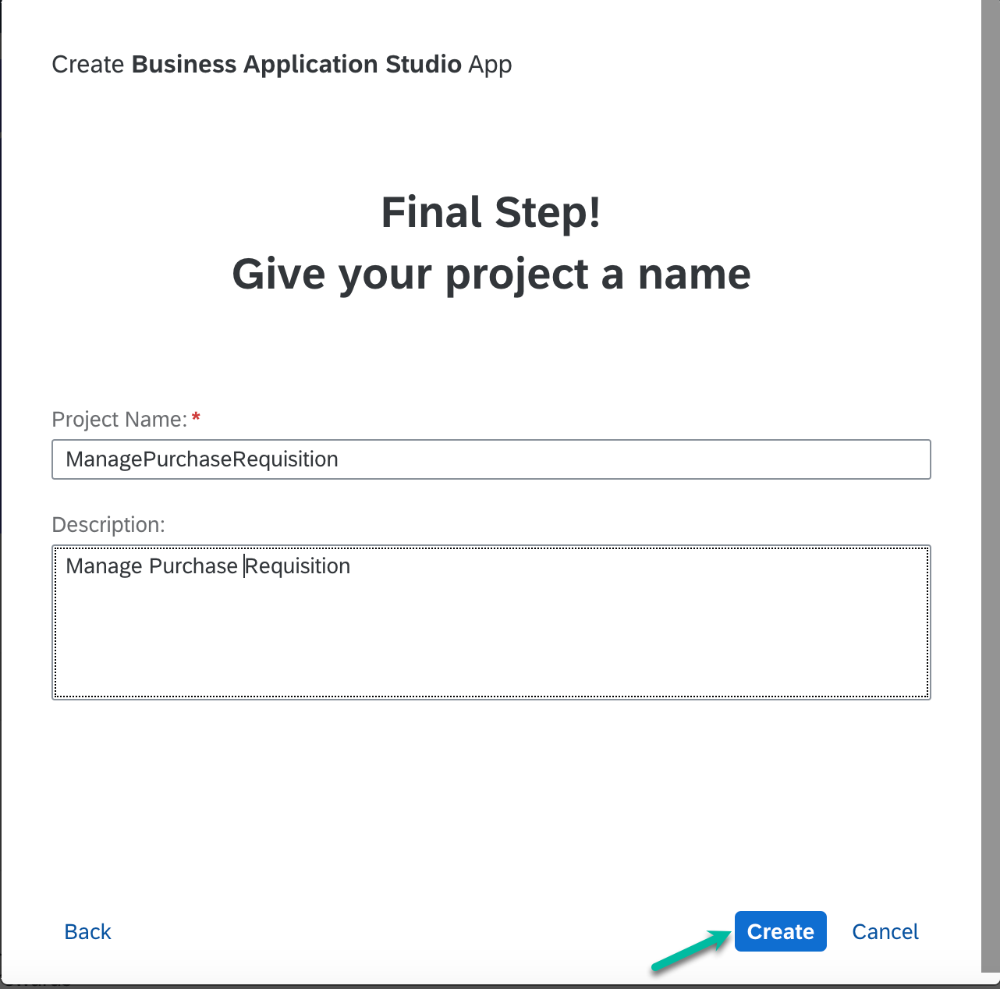

# Exercise 1: Create Application to consume OnlineShop Purchase Requisition event and trigger Purchase Order creation

From this exercise on, we will switch to SAP's Business Technology Platform (BTP).

In this exercise we will consume the event created in OnlineShop app in S/4HANA from the previous chapter. Broadly there will be three main steps:
- Consume an S/4HANA On-Premise event
- Add an external API to read Purchase Requisition data in BTP
- Update purchase requisition data to trigger Purchase order creation back in S/4HANA system

To create such a scenario we need to do the following:
- create a project in SAP Build Lobby
- data model for purchase requisition
- add external API and event to the project and consume it
- create service
- create UI
- deploy the app to cloud foundry
- test

# Create a new Project in the SAP Build Lobby
Hint: Please use Google Chrome or Microsoft Edge to follow the exercises
[SAP Build Apps Lobby](https://lcapteched.eu10.build.cloud.sap/lobby)
1. Open the SAP Build Lobby and login with the provided user-id and password.

2. In the SAP Build Lobby choose the button Create to start

3. A new window opens asking you what you would like to do. Select Build an Application.

4. You are asked which type of application you would like to build. Select the option for Pro Developers.

5. Add a Project Name and a Short Description. Please name the project 'PurchaseRequisition<Your_User_ID>' and choose the same user-id you used for login.

6. SAP Business Application Studio opens with the project you just defined. It will take some time until your project is created.
   

Continue to - **[Build Exercise 2: SAP Create Data Model](../../../buildcode/exercises/ex2/README.md)**

