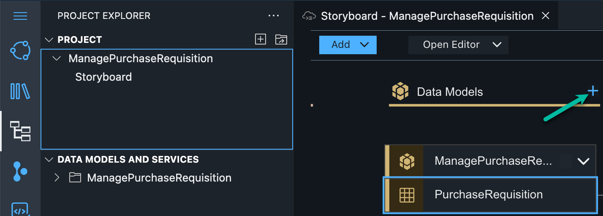
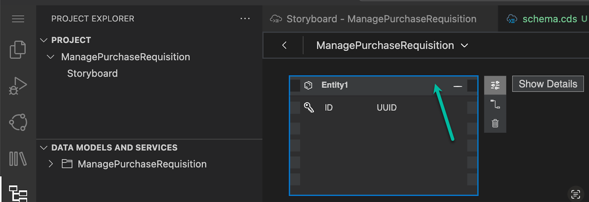
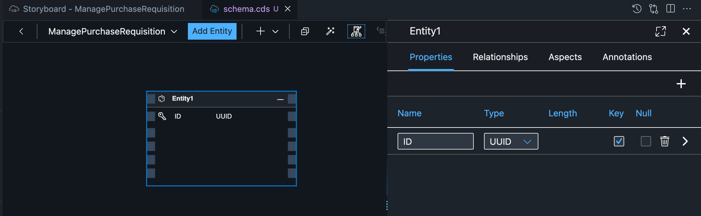
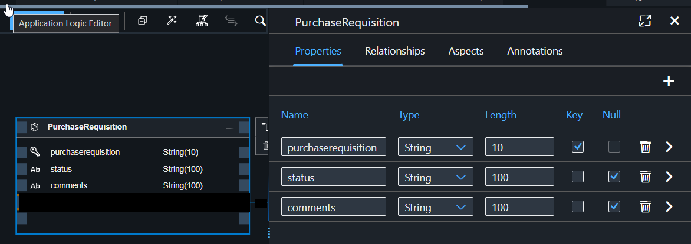
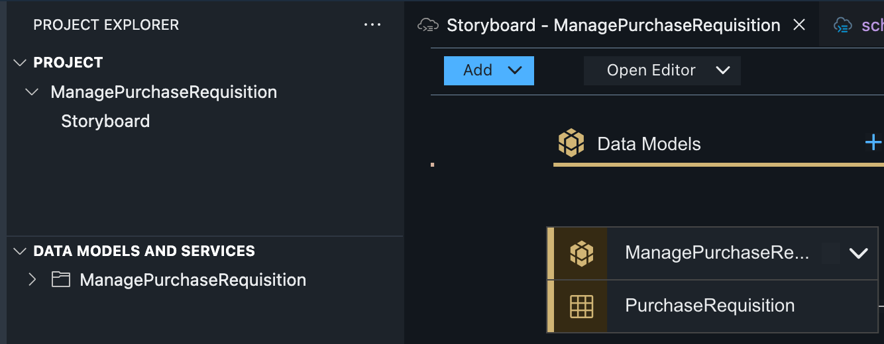
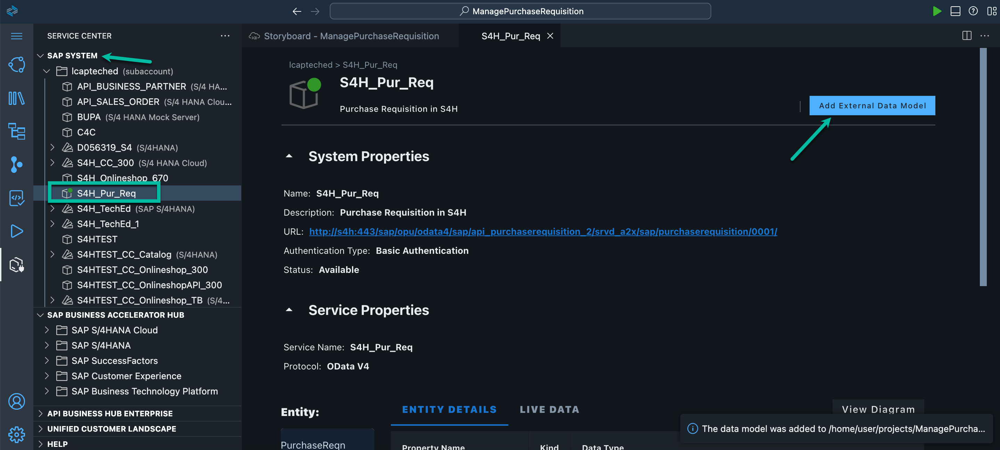
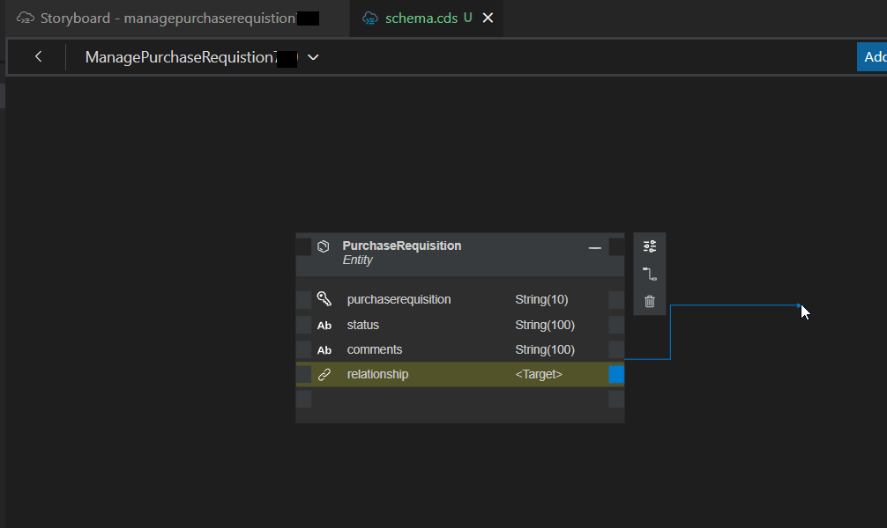
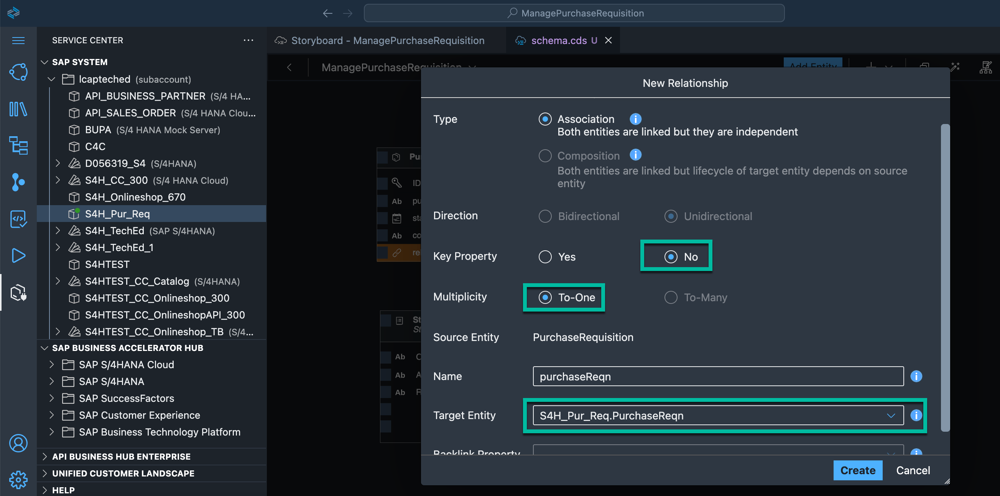
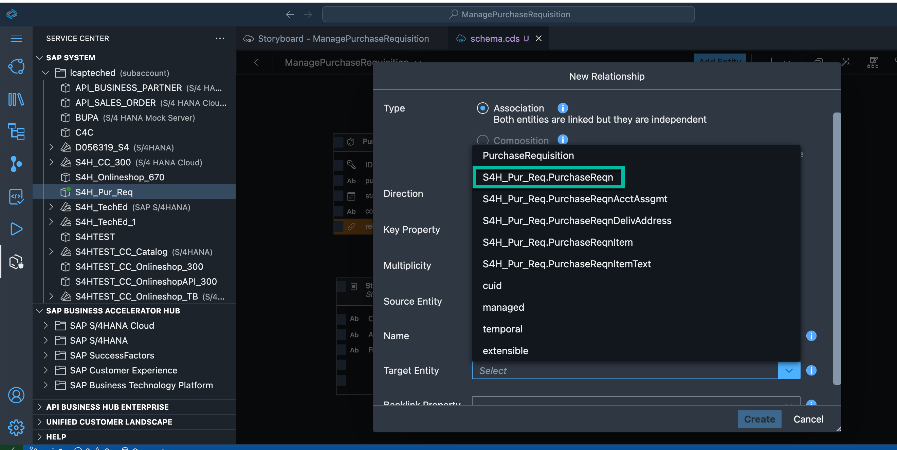
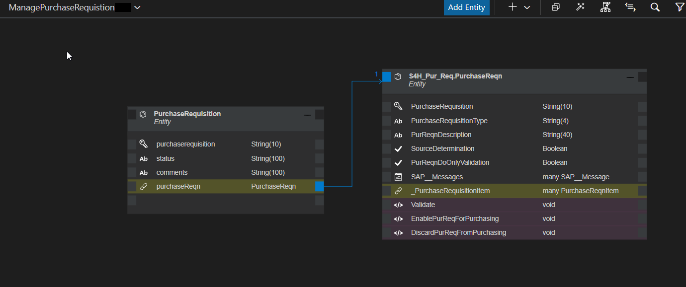

# Exercise 2: Create data model and external data model 

Now you can start the development of your application. First you will model your application and define the database table and the relationship between the entities.

1. In this application Data Model 'PurchaseRequisition', to hold the data are needed. To create a Data Model open SAP Business Application Studio, look for the tile Data Models and choose the + icon to add a new entity.
   

2. A new entity is created for you. Click on the tile and choose Show Details to edit the entity.
   

3. Change the Entity Name to PurchaseRequisition. Remove the property ID and choose the + icon in the table to add the following properties:

    | Step | Parameter | Value |
    |:-----|:----------|:------|
    | A | Name | **purchaserequisition** |
    | B | Type | **String** (default) |
    | C | Length | 10 |
    | D | Default | Leave empty (default) |
    | E | Key | checked |
    | F | Null | **No**  |

    | Step | Parameter | Value |
    |:-----|:----------|:------|
    | A | Name | **status** |
    | B | Type | **String** (default) |
    | C | Length | Leave empty |
    | D | Default | Leave empty (default) |
    | E | Key | Leave unchecked (default) |
    | F | Null | **Yes** (default) |
   
    | Step | Parameter | Value |
    |:-----|:----------|:------|
    | A | Name | **comments** |
    | B | Type | **String** (default) |
    | C | Length | Leave empty |
    | D | Default | Leave empty (default) |
    | E | Key | Leave unchecked (default) |
    | F | Null | **Yes** (default) |

4. Choose the Checkmark Icon to create the entity.

5. Now, you can see an entity in the Data Model Editor.

6. In a next step you will add an external API to the project. Go to the **Service Center**, expand node **lcapteched** select *S4H_Pur_Req*. Click on the blue button on right hand side view **Add External Data Model**   

7. In a next step you will describe the interconnection between PurchaseRequisition and External data model by defining a relationship, so each PurchaseRequisition on BTP has a S/4HANA Purchase Requisition associated to it. Click on the header of the table. Choose Add relationship Icon in the menu appearing on the right. 
   

8. A pop-up will appear. Select S4H_Pur_Req.PurchaseReqn and configure the relationship in the pop-up.In the pop-up screen enter all the required details:

- Select Type: Association
- Select Direction: Unidirectional
- Key property: No
- Select Multiplicity: To-One
- Target Entity: S4H_Pur_Req.PurchaseReqn
- 

9. Choose Create Button to save

Continue to - **[Build Exercise 3: SAP Create Service](../../../buildcode/exercises/ex3/README.md)**

