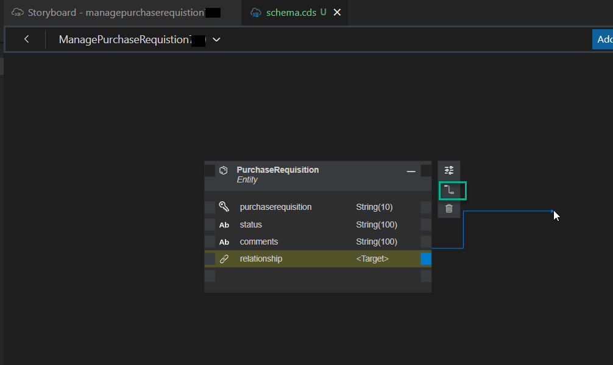

# Exercise 2: Create a data model and and external data model 

Now you can start developing your application. First, you will model your application and define the database table and the relationship between the entities.

Your application opens in the Storyboard. This is the landing page that provides a semantic view of your entire CAP application and UI. We will use the graphical modelers of SAP Business Application Studio to complete this part of the hands-on workshop. 

>NOTE: Everything in SAP Business Application Studio is auto-saved.
 
   
  
We will create a new CAP Data Model called 'PurchaseRequisition' to hold the data coming from the RAP interface. 

**To create a new Data Model:**

1. In the **Data Models** tile, click the **+** icon. A new entity is created for you.
   
   

2.  Click on the entity's title, and change the entity name to `PurchaseRequisition`. 
3.  Click on the entity's tile, and select **Show Details** to edit the entity.

   

4. In the **Properties** tab of the editor, click the trash can to delete the **ID** row.
5. Click the **+** (Add property) icon to add the **purchaserequisition** property:

    | Parameter | Value |
    | :---------- | :------ |
    | Name | **purchaserequisition** |
    | Type | **String** (default) |
    | Length | 10 |
    | Key | checked |
    | Null | **No**  |

6. Click the **+** (Add property) icon again to add the **status** property:

    | Parameter | Value |
    |:----------|:------|
    | Name | **status** |
    | Type | **String** (default) |
    | Length | Leave default value |
    | Key | Leave unchecked (default) |
    | Null | **Yes** (default) |

7. Click the **+** (Add property) icon again to add the **comments** property:

    | Parameter | Value |
    |:----------|:------|
    | Name | **comments** |
    | Type | **String** (default) |
    | Length | Leave default value |
    | Key | Leave unchecked (default) |
    | Null | **Yes** (default) |

   
   

8. Check that the entity is updated with the fields, and close the right-hand panel.

   You can see the entity in the Project Explorer.

   

**To create a new external API to the project:**

1. Go back to the Storyboard tab and click on the "+" in the **External Resources** tile. The **Service Center** view opens to the left.

   

3. Expand **SAP System** -> **lcapteched**, and select *S4H_Pur_Req*.
4. Click **Add External Data Model**.
   
   

   The external API is added to the **External Resources** tile in the Storyboard.

   

Next, you will describe the interconnection between **PurchaseRequisition** and the external data model by defining a relationship, so each PurchaseRequisition on STP BTP will have an SAP S/4HANA Purchase Requisition associated to it.
   
1. In the Storyboard, click the 'PurchaseRequisiton' data model under the **Data Models** tile, and click 'Open in Graphical Modeler'.

     

   You should now be on a tab called `schema.cds`. 

2. Click on the header of the 'PurchaseRequisiton' entity, and click the **Add Relationship** icon. You will get an arrow. 
   
   

3. Drop the arrow anywhere on the canvas. The **New Relationship** dialog appears.
4. Enter all the required details:

   - **Type**: Association
   - **Direction**: Unidirectional
   - **Key Property**: No
   - **Multiplicity**: To-One
   - **Target Entity**: S4H_Pur_Req.PurchaseReqn

   

5. Click **Create**. You can now see the relationship between the external API and the PurchaseRequisition entity created by you.

   

6. Click on the hamburger icon, and select **View** -> **Explorer** to open the Explorer view.  

   

   With SAP Business Application Studio, you are not restricted to using just the graphical modelers. Each modeler generates code files which you can open from the **Explorer** view and edit.

1. Open the `schema.cds` file.
   


3. Replace the "Association" line with the following code:
   
```js
purchaseReqn : Association to one S4H_Pur_Req.PurchaseReqn on purchaseReqn.PurchaseRequisition = purchaserequisition;
```


   

This is the condition for association with S/4HANA API. The relationship between CAP model and S/4HANA model is established.

Continue to - **[Build Exercise 3: SAP Create Service](../../../buildcode/exercises/ex3/README.md)**


