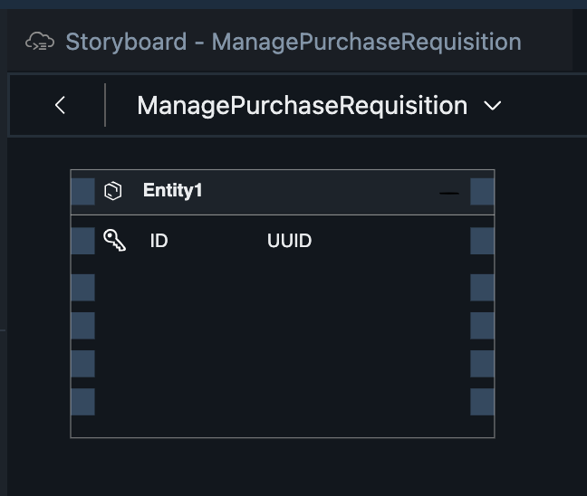
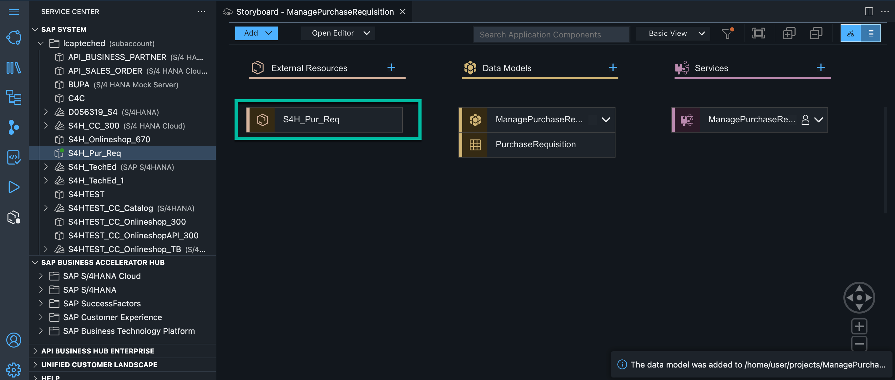

# Exercise 2: Create data model and external data model 

Now you can start the development of your application. First you will model your application and define the database table and the relationship between the entities.

1. Your application is opened on the Storyboard. This is the landing page that you can use to view your whole CAP application and UI in a semantic view. We will use the graphical modelers of SAP Business Application Studio to complete this part of the hands-on workshop. 

*NOTE - everything in SAP Business Application Studio is auto-saved.*
 
 
  
2. We will create a new CAP Data Model called 'PurchaseRequisition' to hold the data coming from the RAP interface. To create a new Data Model, look for the tile Data Models and choose the + icon to add a new entity.
   


3. A new entity is created for you. Click on the tile and choose Show Details to edit the entity.

   


4. Change the Entity Name to PurchaseRequisition. Remove the property ID and choose the + icon in the table to add the following properties:

    | Step | Parameter | Value |
    |:-----|:----------|:------|
    | A | Name | **purchaserequisition** |
    | B | Type | **String** (default) |
    | C | Length | 10 |
    | D | Default | Leave empty (default) |
    | E | Key | checked |
    | F | Null | **No**  |

    | Step | Parameter | Value |
    |:-----|:----------|:------|
    | A | Name | **status** |
    | B | Type | **String** (default) |
    | C | Length | Leave empty |
    | D | Default | Leave empty (default) |
    | E | Key | Leave unchecked (default) |
    | F | Null | **Yes** (default) |
   
    | Step | Parameter | Value |
    |:-----|:----------|:------|
    | A | Name | **comments** |
    | B | Type | **String** (default) |
    | C | Length | Leave empty |
    | D | Default | Leave empty (default) |
    | E | Key | Leave unchecked (default) |
    | F | Null | **Yes** (default) |


5. Choose the Checkmark Icon to create the entity.

6. Now, you can see an entity in the Data Model Editor.


7. In a next step you will add an external API to the project. Go to the **Service Center**, expand node **lcapteched** select *S4H_Pur_Req*. Click on the blue button on right hand side view **Add External Data Model**   




8. Next you will describe the interconnection between PurchaseRequisition and External data model by defining a relationship, so each PurchaseRequisition on BTP has a S/4HANA Purchase Requisition associated to it. Click on the header of the table. Choose Add relationship Icon in the menu appearing on the right. 
   


9. A pop-up will appear. Select S4H_Pur_Req.PurchaseReqn and configure the relationship in the pop-up.In the pop-up screen enter all the required details:

- Select Type: Association
- Select Direction: Unidirectional
- Key property: No
- Select Multiplicity: To-One
- Target Entity: S4H_Pur_Req.PurchaseReqn
- 


10. Choose Create Button to save


11. Now, go to the explorer. You will find the explorer as shown below:


11. Open file *schema.cds* and replace the "Association" line with the following code:


```js
purchaseReqn : Association to one S4H_Pur_Req.PurchaseReqn on purchaseReqn.PurchaseRequisition = purchaserequisition;
```


This is the condition for association to S/4HANA API. Relationship between CAP model and S/4HANA model is established.

Continue to - **[Build Exercise 3: SAP Create Service](../../../buildcode/exercises/ex3/README.md)**


