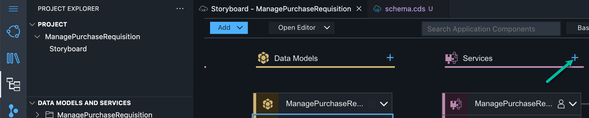
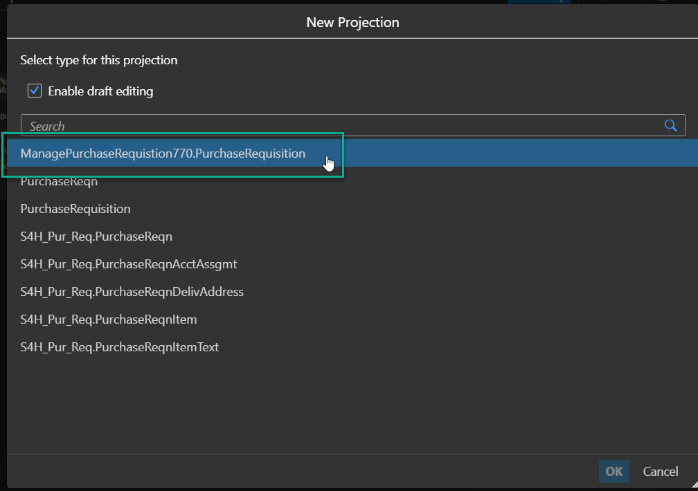
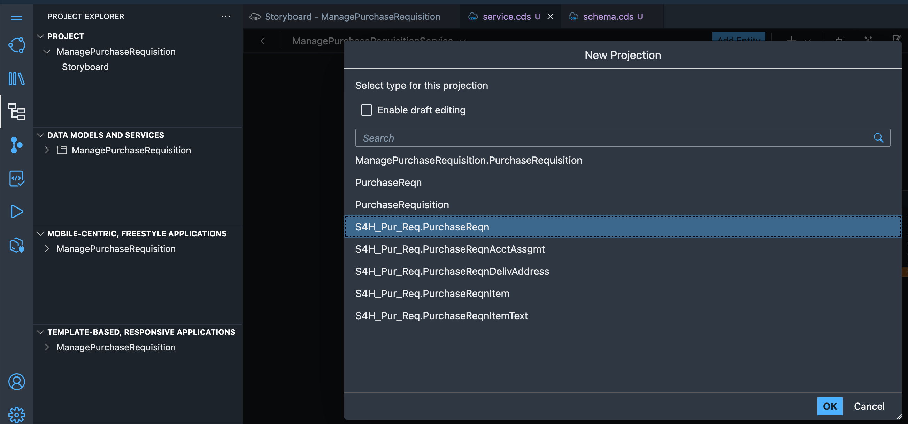
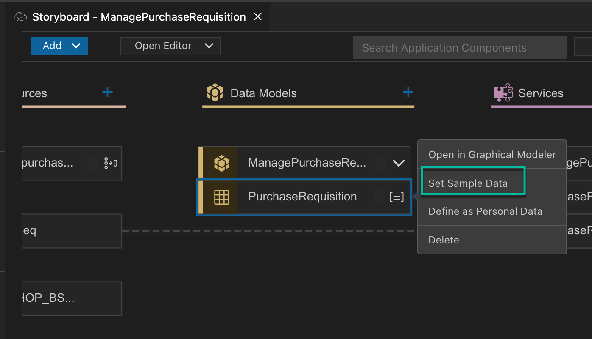
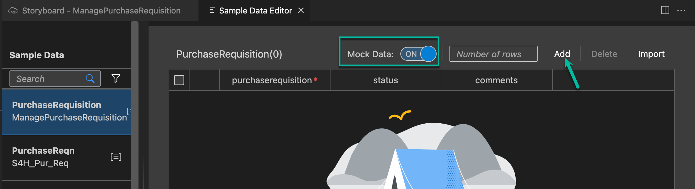
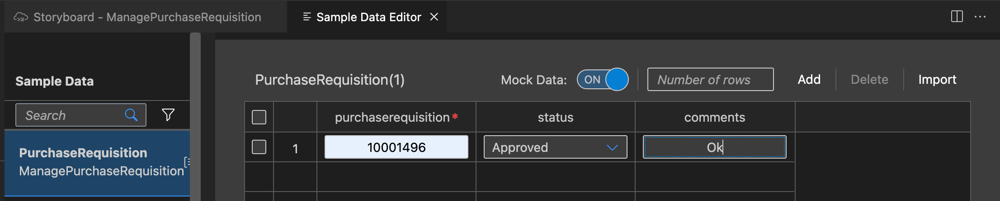
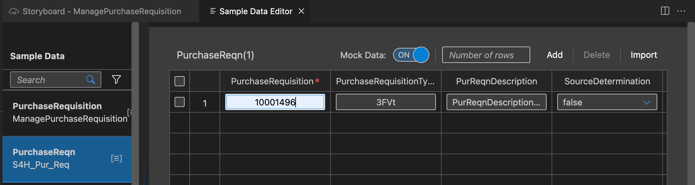

# Exercise 3: Create service 

Now you will create service entities for Purchase Requisition and S4H Purchase Requisition to define which parts of the data models you just have created should be exposed to the application.

1. Go back to the storyboard page of the application. Find the Services tile and choose the + icon to add a new service entity.

2. On the next screen, select ManagePurchaseRequisition-<Your-User-ID>.PurchaseRequisition and choose Ok to finish.

3. Back in service editor, choose Add_Entity and select select S4H_Pur_Req.PurchaseReqn as type and choose Ok to finish.

# Add Sample Data
Once the structure of your application is finished, you can add sample data to the application. You either can use the visual data editor or insert data using a CSV file. Here, we will use the Mock Data generator and then edit the data.

1. Go back to the storyboard of the application. Find the PurchaseRequisition in Data Models and choose *Set Sample Data*.

2. Add data for PurchaseRequisition entity. Click on *Add* and keep *Mock Data* as ON. This adds one row of mock data for the PurchaseRequisiton entity. Change the value of 'purchaserequisition' field to 10001496. Note that the values of the other auto-generated fields may be different for you.

3. Repeat the above step for PurchaseReqn, S4H entity. Click on *Add* and keep *Mock Data* as ON. This adds one row of mock data for the PurchaseRequisiton entity. Change the value of 'purchaserequisition' field to 10001496. Note that the values of the other auto-generated fields may be different for you.

Continue to - **[Build Exercise 4: SAP Add and consume an event from S/4HANA On-Premise](../../../buildcode/exercises/ex4/README.md)**

