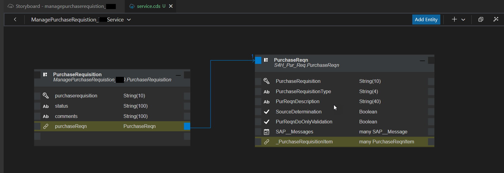

# Exercise 3: Create a Service 

Now, you will create service entities for the **Purchase Requisition** and **S4H Purchase Requisition** services to define which parts of the data models you just created should be exposed to the application.

1. In the storyboard, go to the **Services** tile, and click + (Add a service entity).

   

2. In the **New Projection** dialog, select ManagePurchaseRequisitionXXX.PurchaseRequisition (where XXX is the 3-digit code provided in your SAP Build Code username) and click **Ok**.

   

3. Back in the editor, click **Add Entity**. A new entity is created.
4. Drop the entity anywhere on the canvas, and select **S4H_Pur_Req.PurchaseReqn** as the projection type.
5. Click **Ok**.

   

Your `service.cds` tab should now look like this

    

# Add Sample Data
Once the structure of your application is ready, you can add sample data to it. You can either use the visual data editor, or you can insert data using a CSV file. Here, we will use the Mock Data Generator and then edit the data.

1. In the storyboard, go to the **Data Models** tile, and select the **PurchaseRequisition** entity, and click *Add Sample Data*.

   

2. In the Sample Data Editor, click *Add* and keep *Mock Data* as ON. This adds one row of mock data for the **PurchaseRequisiton** entity.
   
4. Change the value of 'purchaserequisition' field to 10001496.
   >Note that the values of the other auto-generated fields may be different for you than what is shown in the example.

   

3. From the list of entities on the left, select the **PurchaseReqn** entity.
4. In the Sample Data Editor, click *Add* and keep *Mock Data* as ON.
5. Change the value of 'purchaserequisition' field to 10001496. 
   >Note that the values of the other auto-generated fields may be different for you than what is shown in the example.
   

Continue to **[Build Exercise 4: Add and consume an event from S/4HANA On-Premise](../../../buildcode/exercises/ex4/README.md)**

