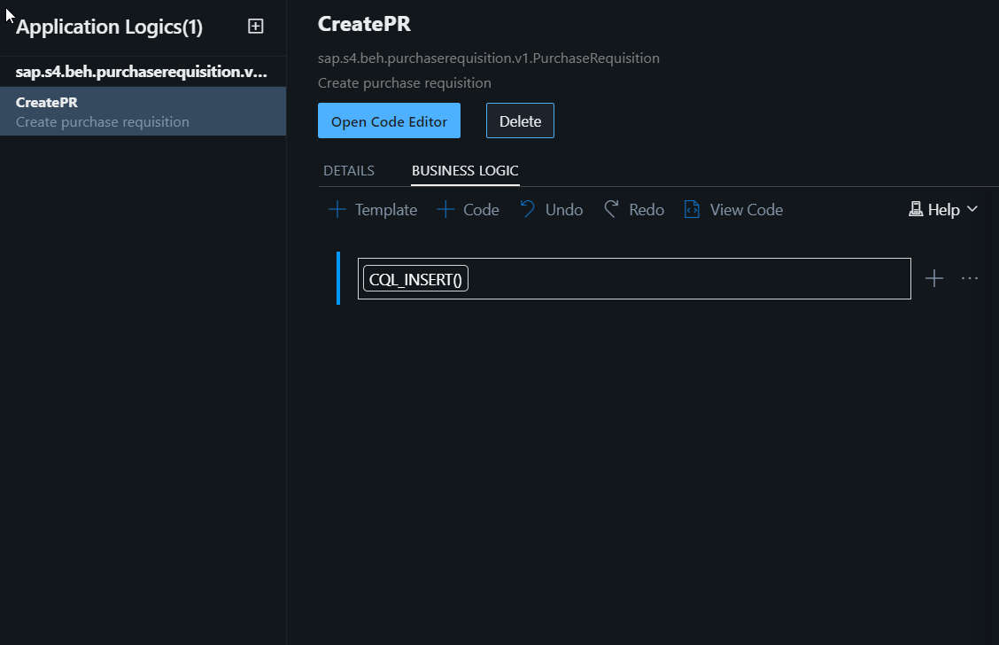

# Exercise 4: Add and consume an event from S/4HANA On-Premise system
Now you will go to the **Service Center** and add an event to the project.

1. Go to the **Service Center** on the left panel.


2. Open node **SAP Business Accelerator Hub -> SAP S/4HANA -> S4HANABusinessEvents**, select the magnifier icon and search for "Purchase Requisition"


3. Click on Add event button


4. Event is added to the project and is available under "External Resources".


5. Next we will consume this event.


6. This will open the 'Application Logic Editor'. Choose the "External Service Event" as 'Created.v1 and the name as "CreatePR" and click on Add. This will allow you to add custom logic to get the data from the API based on the event. 


7. Add logic to insert data in PurchaseRequisition entity. Put the description as "Create purchase requisition"


8. Click on Business Logic and click on "+ Template" and choose "Function Call"


9. Click on Configure Function and choose CQL_Insert().


10. Double-cick on CQL_Insert to open the right-hand panel.

11. In the Entity, choose ManagePurchaseRequisition_XXXService.PurchaseRequisition. In the Column Name, choose "purchaserequisition" column from the drop-down, and paste "message.data.PurchaseRequisition" in the Values column


12. Open Code Editor -> Application Logic to view the code file.

replace the **await** statement code with the line below. Make sure to replace XXX with the 3-digit number of your username:
```js
await INSERT .into `ManagePurchaseRequisitionXXXService.PurchaseRequisition` .entries({purchaserequisition:message.data.PurchaseRequisition});
```
The code should look like this


Continue to - **[Build Exercise 5: Create UI application](../../../buildcode/exercises/ex5/README.md)**
