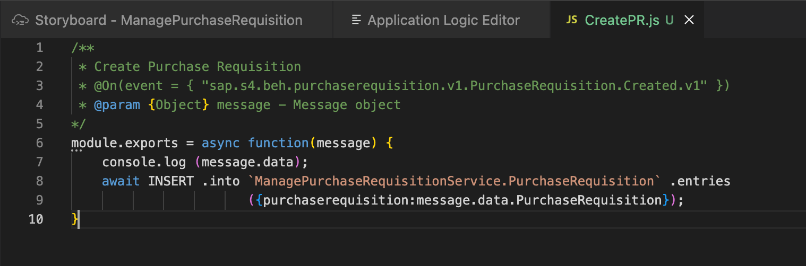

# Exercise 4: Add and consume an event from the S/4HANA On-Premise system

We will now add an event to the project in the **Service Center**.

1. From the activity bar, click the Service Center icon.
2. In the **Service Center** view, select **SAP Business Accelerator Hub -> SAP S/4HANA -> S4HANABusinessEvents**.

   

2. Click the magnifier icon next to **S4HANABusinessEvents**, and search for "Purchase Requisition".

   

3. Click "Add Events".

   

   The event is added to the project, and is available under the "External Resources" tile.
   
   

5. Click on the event, and select **Consume Event**.
   
   

7. In the 'Application Logic Editor' dialog:<br>
   * Select the **External Service Event** radio button.
   * From the **External Service Event** dropdown list, select `Created.v1`.
   * In the **Name** field, enter `CreatePR`.
   * Click **Add**.
     
   This will allow you to add custom logic to get the data from the API based on the event. 

   

7. Add logic to insert data in the **PurchaseRequisition** entity. In the Description field, enter `Create purchase requisition`.
   
   

8. Click **Open Code Editor**, and select **Application Logic** to view the code file.

   
   
9. Replace the **await** statement code with the line below. Make sure to replace XXX with the 3-digit number of your username.
    
   ```js
   await INSERT .into `ManagePurchaseRequisitionXXXService.PurchaseRequisition` .entries({purchaserequisition:message.data.PurchaseRequisition});
   ```
   
   The code should look like this:
   
   

Continue to **[Build Exercise 5: Create UI application](../../../buildcode/exercises/ex5/README.md)**
