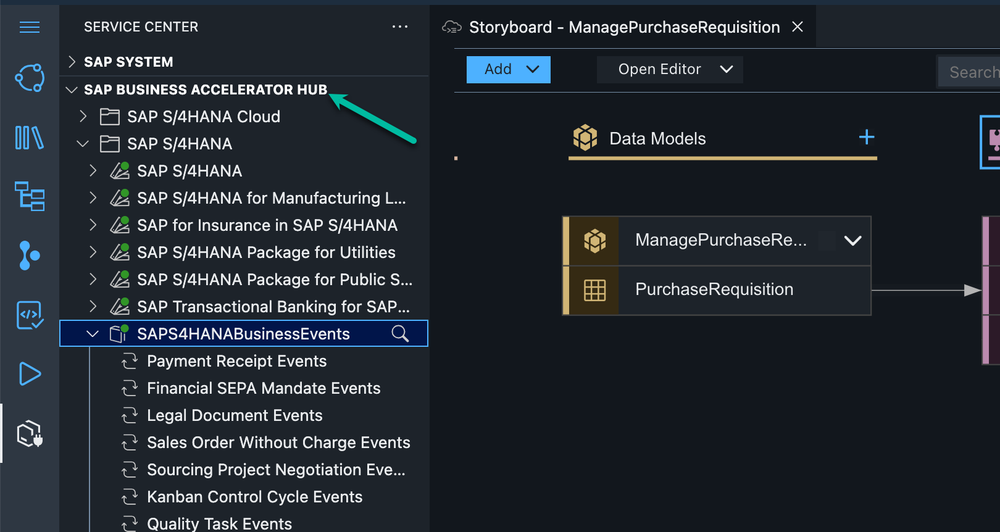
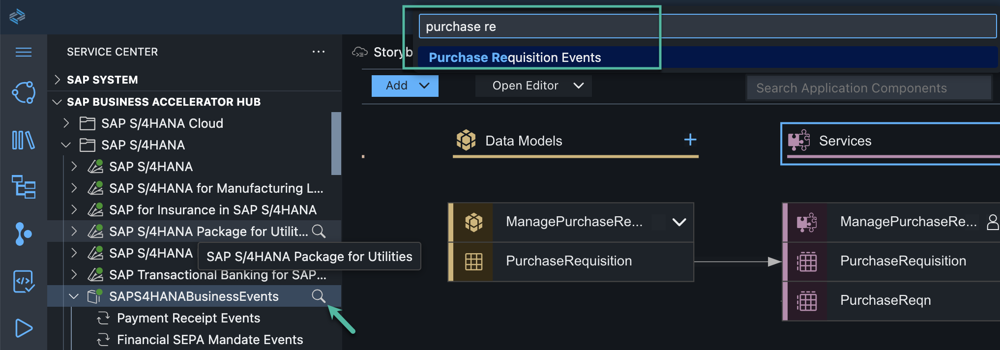
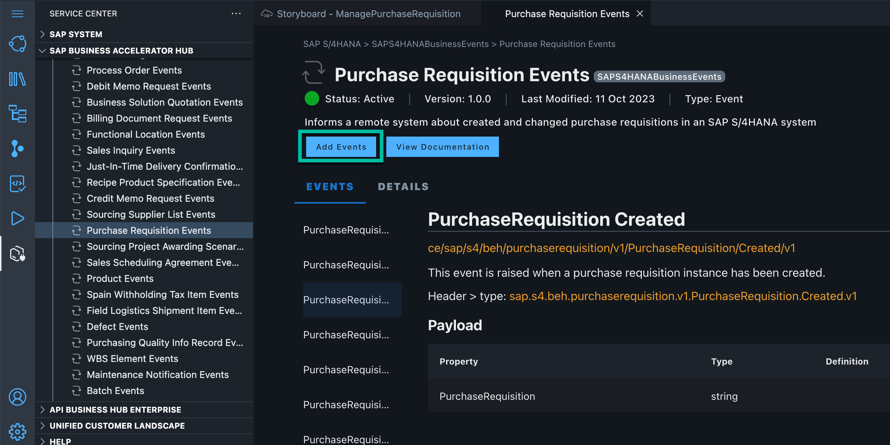
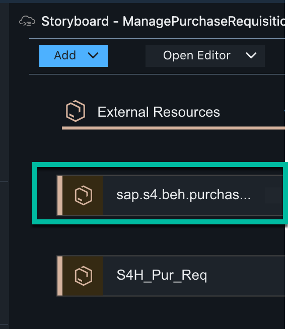
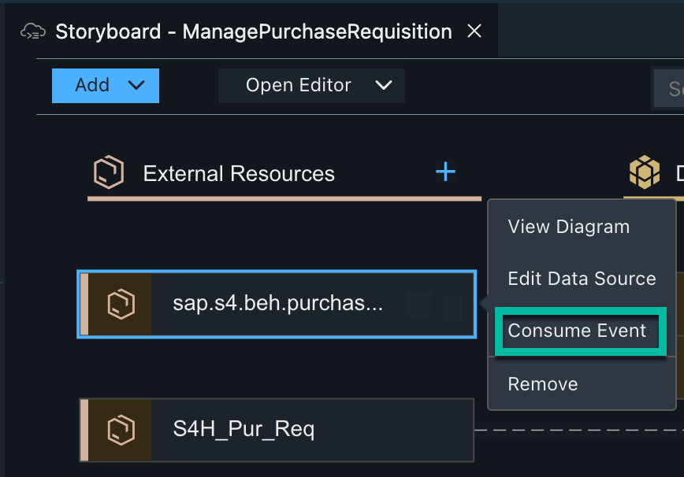
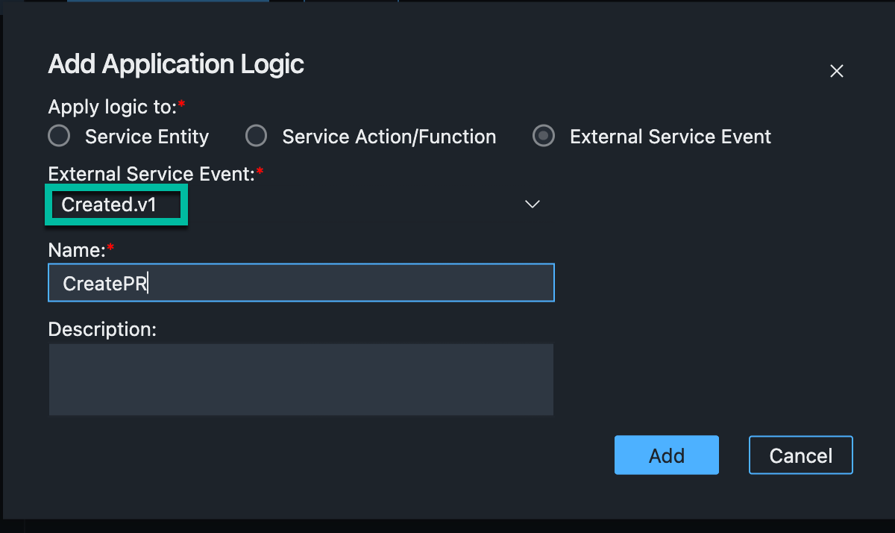
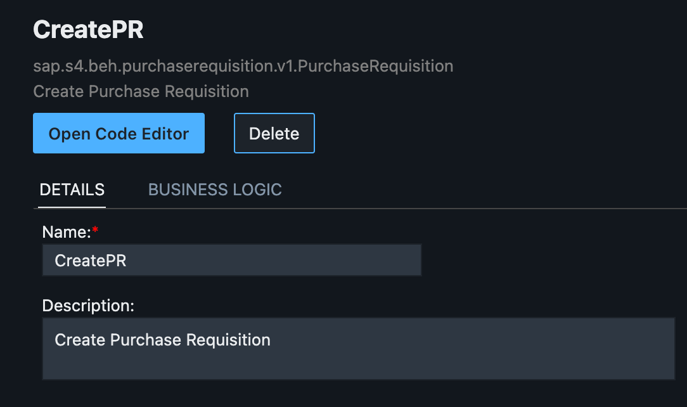
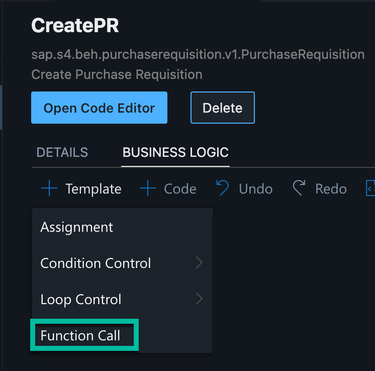
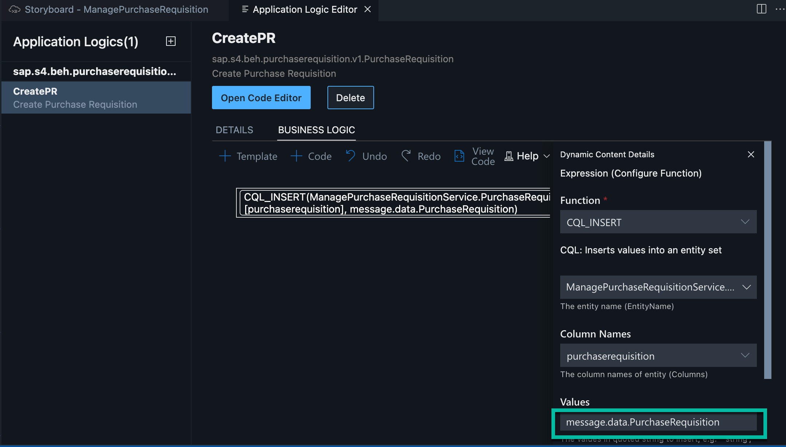
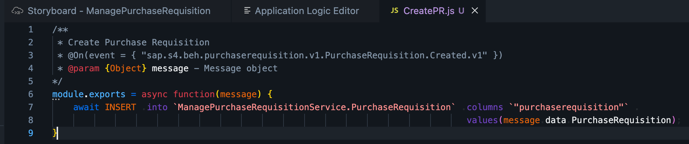

# Exercise 4: Add and consume an event from S/4HANA On-Premise system
Now you will go to the **Service Center** and add an event to the project.

1. Go to the **Service Center** on the left panel.



3. Open node **SAP Business Accelerator Hub -> SAP S/4HANA -> S4HANABusinessEvents** and search for "Purchase Requisition"


4. Click on Add event button


5. Event is added to the project and is available under "External Resources".


6. Next we will consume this event.


7. This will open the 'Application Logic Editor'.


8. Add logic to insert data in PurchaseRequisition entity.




10. Open Code Editor to view the code

replace the **await** statement code with:
```js
await INSERT .into `ManagePurchaseRequisitionService.PurchaseRequisition` .entries({purchaserequisition:message.data.PurchaseRequisition});
```
Continue to - **[Build Exercise 5: Create UI application](../../../buildcode/exercises/ex5/README.md)**
