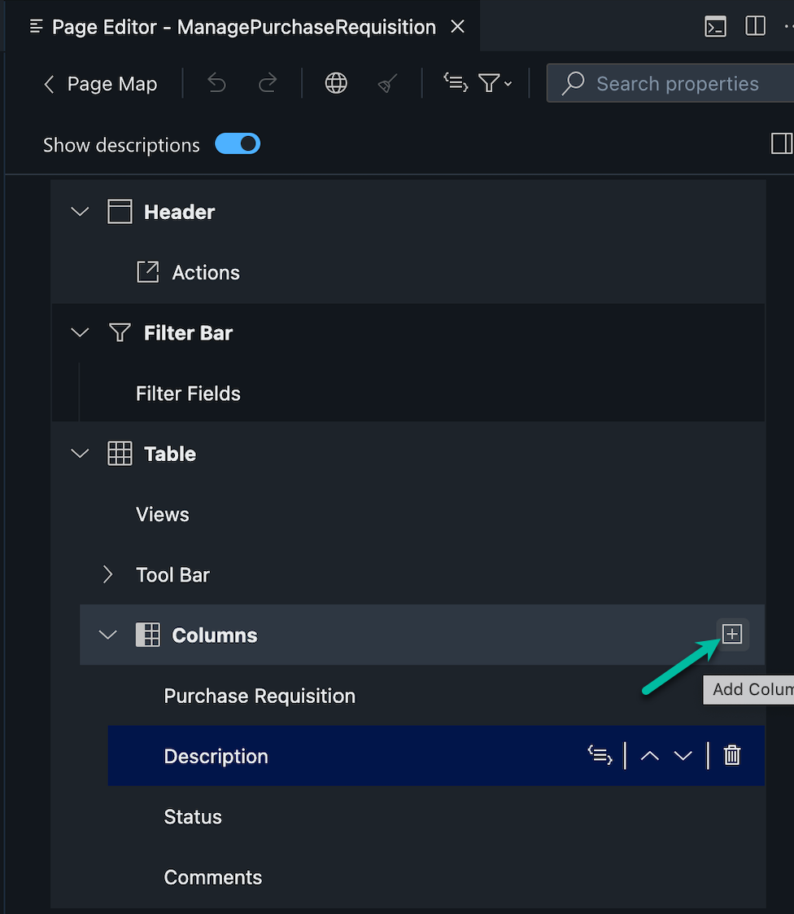
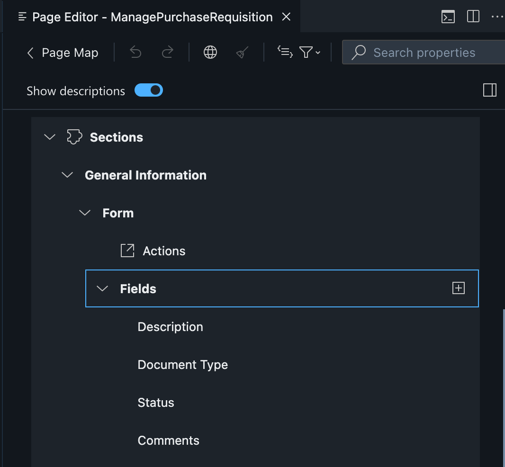

# Exercise 5: Create UI Application
After defining the foundation of your application in the previous chapter, we will add an SAP Fiori elements based User Interface to the application.

1. Go to the storyboard page and find the UI Application tile and choose the + icon to add a new user interface.

2. A screen will show up where you can add the Display Name: ManagePurchaseRequisition-<Your-User-ID> and enter a description. Choose Next.

3. Select UI Application type as Template-Based, Responsive Application to create a SAP Fiori elements based UI. Choose Next.

4. Choose UI application template as List Report Page. Choose Next.

5. Select main entity PurchaseRequisition as main entity in Data Objects, to show PurchaseRequisition entity on UI. Choose Finish.

6. Find the tile User Interfaces and choose the entry *Manage Purchase Requisition*.

   
7. Find the List Page entry and choose the edit icon.

   
9. Add the following fields to thh list page

- Purchase Requisition
- purchaseReqn/PurReqnDescription
- Status
- Comments
- purchaseReqn/_PurchaseRequisitionItem/PurchasingDocument

11. Find the Object Page entry and choose the edit icon.

8. Expand the **Header** section and add field 'Purchase Requisition' in *Header Sections*
  
9. In **Sections** under *General Information* add the following fields
- purchaseReqn/PurReqnDescription
- Comments

10. Next, choose the + icon to add new section to the UI. In the dropdown, select Add Form Section.
   
11. In the popup enter Label as Item Details.
      
10. Click on Add button

11. In the entry Section open "Items Details". Choose the + icon to add new fields to the UI. In the dropdown, select Add Basic Columns.

12. In the dropdown choose the following fields inside risks

- Material
- ItemText
- Ordered Quantity
- Base UoM
- Supplier

13. Click on Add button

Continue to - **[Build Exercise 6: Test](../../../buildcode/exercises/ex6/README.md)**
