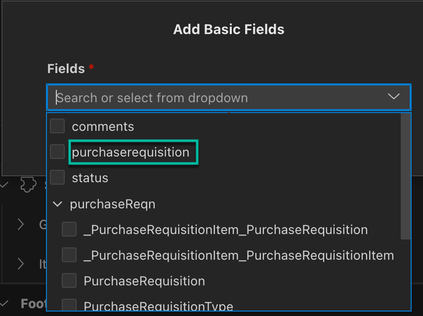

# Exercise 5: Create UI Application

In the previous chapter, we defined the foundation of your application. We will now add an SAP Fiori elements-based user interface to the application.

1. In the storyboard, click + (Add UI) in the **UI Applications** tile.
   

2. In the Create New UI Application wizard,
   * In the **Display Name** field, enter `Manage Purchase Requisition`
   * In the **Description** field, enter a short description.
   * Click **Next**.

   

3. Select the **Template-Based, Responsive Application** tile, and click **Next**.

   

4. Select the **List Report Page** tile, and click **Next**.

   

5. In the Data Objects step, select **PurchaseRequisition** as the main entity, and click **Finish**.

   

   After a few seconds, the Page Map opens on the right of the page. 
   If it does not open, go to the Storyboard, and on the **UI Applications** tile, click on **Manage Purchase Requisition**, and select **Open in Page Map**.

   
   
6. In the Page Map, select the **List REport** entry, and click the edit icon.

   
   
7. Under **Table -> Columns**, click **+** (Add Columns).

    

8. Select **Add Basic Columns**.

   

9. From the **Columns** dropdown list, select the following checkboxes:
    
   * **Purchase Requisition**
   * **PurReqnDescription**
   * **_PurchaseRequisitionItem** -> **PurchasingDocument**
      > Note: Even though the Purchasing Document is an item-level field, it is used on the list page to keep it simple for the use case. It has a 1:n relationship with the Purchase Requisition number.

   

10. Click **Add**.
11. In the **Page Editor** toolbar, click **Page Map**.
12. Select the **Object Page** entry, and click the edit icon.

   

13. Under **Header -> Header Sections**, click **+** (Add Sections), and select **Add Form Section**.

    
    
14. In the Label field, enter `Purchase Requisition`, and click **Add**.

   

15. Under **Header -> Header Sections** -> **Purchase Requisition** -> **Form** -> **Fields**, click **+** (Add Basic Fields).

   

16.  Click **Add Basic Fields**.
17.  From the **Fields** dropdown list, select the **purchaserequisition** checkbox, and click **Add**.

   

18. Under **Sections** -> **General Information** -> **Form** -> **Fields**, click **+** (Add Basic Fields).
19. Click **Add Basic Fields**.
20. From the **Fields** dropdown list, select the **PurReqnDescription** and the **PurchaseRequisitionType** checkboxes, and click **Add**. 

   

21. In the **Sections** line, click **+** (Add Sections).

    
    
22. Select **Add Form Section**.

   
    
 
23. In the **Label** field, enter `Item Details`, and click **Add**.

   

24. Under **Sections** -> **Item Details** -> **Form** -> **Fields**, click **+** (Add Basic Fields).
25. Select **Add Basic Fields**.

     

26. From the **Fields** dropdown list, select the following checkboxes, and then click **Add**.
    * **purchaseReqn -> _PurchaseRequisitionItem -> Material**
    * **purchaseReqn -> _PurchaseRequisitionItem -> PurchaseRequisitionItemText**
    * **purchaseReqn -> _PurchaseRequisitionItem -> RequestedQuantity**
    * **purchaseReqn -> _PurchaseRequisitionItem -> BaseUnit**
    * **purchaseReqn -> _PurchaseRequisitionItem -> Plant**
    * **purchaseReqn -> _PurchaseRequisitionItem -> Supplier**

       

Continue to **[Build Exercise 6: Preview and test the app](../../../buildcode/exercises/ex6/README.md)**
