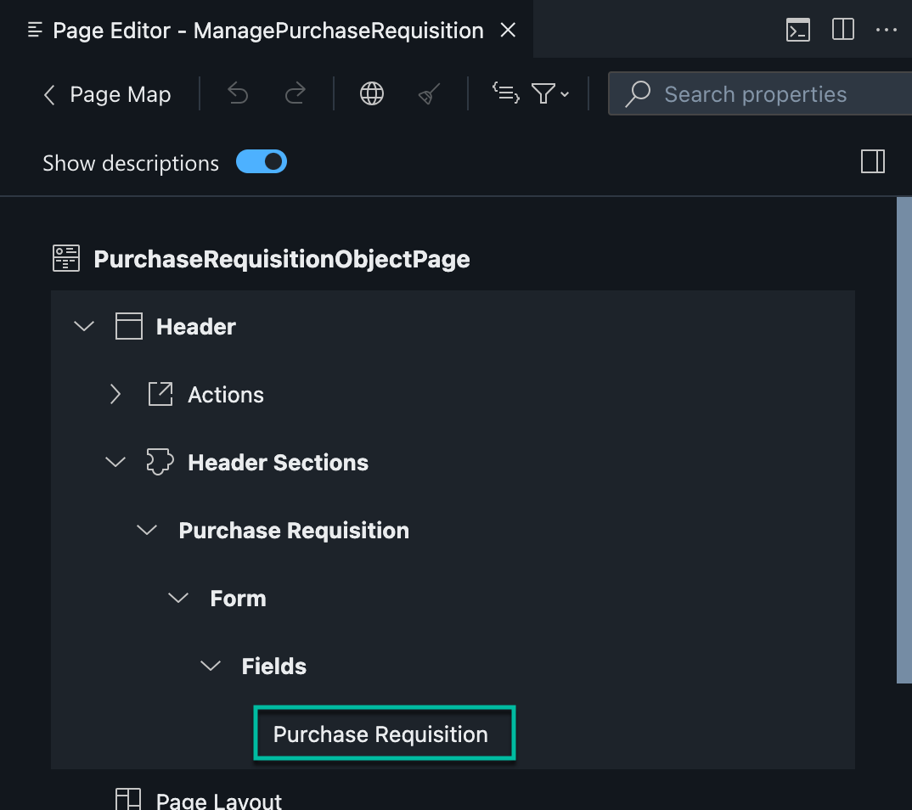

# Exercise 5: Create UI Application
After defining the foundation of your application in the previous chapter, we will add an SAP Fiori elements based User Interface to the application.

1. Go to the storyboard page and find the UI Applications tile and choose the + icon to add a new user interface.

2. A screen will show up where you can add the Display Name: ManagePurchaseRequisition-<Your-User-ID> and enter a description. Choose Next.

3. Select UI Application type as Template-Based, Responsive Application to create a SAP Fiori elements based UI. Choose Next.

4. Choose UI application template as List Report Page. Choose Next.

5. Select PurchaseRequisition as the main entity in Data Objects, to show PurchaseRequisition entity on UI. Choose Finish.

6. Page Map will open automatically in a few seconds. If not, go to Storyboard to find the tile UI Applications and click on *Manage Purchase Requisition* to select "Open in Page Map".

   
7. In the Page Map, find the List Page entry and choose the edit icon.

   
8. Add the following fields to the list page by clicking on the + near Columns
   

9. Click on Add Basic Columns

11. Add the following columns:
- Purchase Requisition
- PurReqnDescription
- _PurchaseRequisitionItem/PurchasingDocument

> Note: Though Purchasing Document is an item-level field, it is used on list page to keep it simple for the use case. It has 1:n relationship with Purchase Requisition number.

9. Find the Object Page entry and choose the edit icon.

10. Expand the **Header** section and add a Form Section and name it "Purchase Requisition".

12. Next add Basic Columns.

13.  Add the field 'Purchase Requisition' in *Header Sections*

14. In **Sections** -> *General Information* -> Form -> Fields, add the following fields
- PurReqnDescription
- PurchaseRequisitionType

13. Next, choose the + icon next to Sections to add a new section. In the dropdown, select Add Form Section.

    
 
14. In the popup enter Label as "Item Details".

 
15. Click on Add button to save.

16. In the Sections, open "Items Details". Choose the + icon on the right side of "Form" -> "Fields", to add new fields to Item Details. In the popover, select "Add Basic Columns".
  

17. Select the following fields:
- purchaseReqn/_PurchaseRequisitionItem/Material
- purchaseReqn/_PurchaseRequisitionItem/PurchaseRequisitionItemText
- purchaseReqn/_PurchaseRequisitionItem/OrderedQuantity
- purchaseReqn/_PurchaseRequisitionItem/BaseUnit
- purchaseReqn/_PurchaseRequisitionItem/Plant
- purchaseReqn/_PurchaseRequisitionItem/Supplier
    
  

Continue to - **[Build Exercise 6: Preview and test the app](../../../buildcode/exercises/ex6/README.md)**
