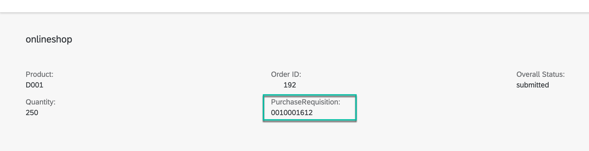
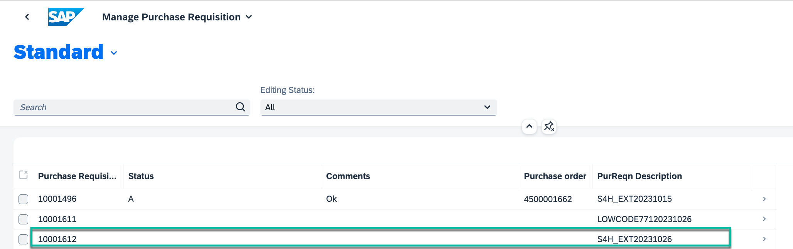

# Preview and Test your Full-Stack Application

## Introduction

Congratulations! You now have a working version of your application. 

In this section, you will perform a quick test run using the [Run Configurations](https://help.sap.com/docs/bas/developing-business-applications-using-productivity-tools/testing-applications?q=run%20and%20debug) in SAP Business Application Studio with sample data.

## Preview the SAP BTP Application

1. Go to the Storyboard.

2. From the activity bar, click the Run Configurations icon. The **Run Configuration** view opens.

   

3. Double-click on `Run managepurchaserequisitionXXX-1`. This will open the Run Configurations editor.
3. Under **Select Data Type**, select the **Live Data** radio button.
4. Under **S4H_Pur_Req service** select the **Destination** radio button.
5. From the **Destination for S4H_Pur_Req service** dropdown list, select `S4H_Pur_Req`. This is to ensure that you get the data from Live the SAP S/4HANA on-premise system.

    

7. Scroll to the bottom of the screen. Under **Events**, select the **Local Messaging**. This will enable us to test the application locally with sample data.

   

8. Run the application from the green icon next to the run configuration's name.

   

   A new browser tab opens showing your application.
   

10. Click on the `Manage Purchase Requisition` tile.
11. Click **Go** to display the sample data.

   

13. Click on the purchase requisition to see the details.

   

14. Click **Edit** to review the purchase requisition.
15. Update the requsition's status to "Approved" or "Rejected", and click **Save**.

    
    
17. Go back to SAP Build Code and click the Stop icon to exit the preview mode.

    

# Run with Event Mesh

1. In the Run Configurations editor, under **Events**, select the **Event Mesh** radio button. This will enable the project to test events in SAP Build Code. You will be able to recieve events from the connected SAP S/4HANA OP system. 

   

3. When prompted, log in to Cloud Foundry.
   
      a. Make sure that the Cloud Foundry endpoint is  `https://api.cf.eu10-004.hana.ondemand.com`. 
      b. Select the **SSO Passcode** radio button, and click the **Open a new browser page to generate your SSO passcode** link.

      

      c. In the identity provider text field, enter 'lcap-platform', and then click **Sign in with Alternative Identity Provider**.
   
      

      d. In the **Temporary Authenication Code** page, copy the passcode. in to the CF panel and log in.

      

      e. In SAP Build Code, paste the passcode in the **Enter your SSO Passcode** field.
   
      f. Click **Sign In**.

6. From the **Select Cloud Foundry Organizaion** dropdown list, select 'TechEdLCAP_lcapteched'.
7. From the **Select Cloud Foundry Space** dropdown list, select 'dev'.

   

7. In the Run Configurations editor, under **Events**, click on the "Create a new Event Mesh Instance" link to create a one-time local setup for event processing. This step is required only once for every project.

   

   This will automatically create the Event Mesh Client and Queue for local testing. Refer to the setup details [here](../../../buildcode/exercises/ex6/appendix.md).

5. Create data using the **[S/4 preview app](https://github.com/SAP-samples/teched2023-AD267/tree/main/exercises/rap/exercises/ex3#exercise-36-check-your-preview-application)** (Open in a new tab), and repeat steps 8 to 13 from the section above to view the data created by live events.

**RAP Order-Purchase Requisition**

**BuildCode-Purchase Requisition**

Once you create an order in RAP UI, you should be able to see the same Purchase Requisition on the SAP Build Code UI. The creation of an order in RAP triggers a **Purchase Order Created** event in the SAP S/4HANA OP system, which is sent to SAP Event Mesh. This event is then consumed in the SAP Build Code CAP backend. You can view the same Purchase Requisition on your SAP Fiori elements UI application in SAP Build Code.

> Notes:  
>  - It will take a few seconds for the new entry to be reflected in the SAP Build Code UI.
>  - This data is temporarily persisted and will not be available if you rerun your application.

