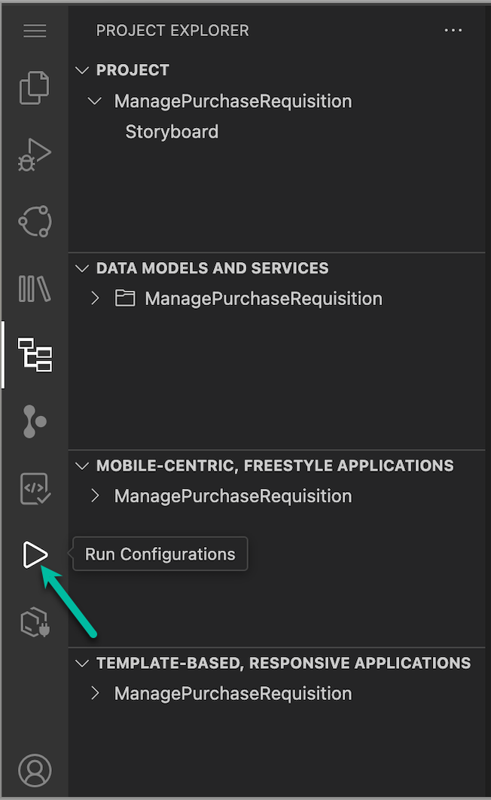
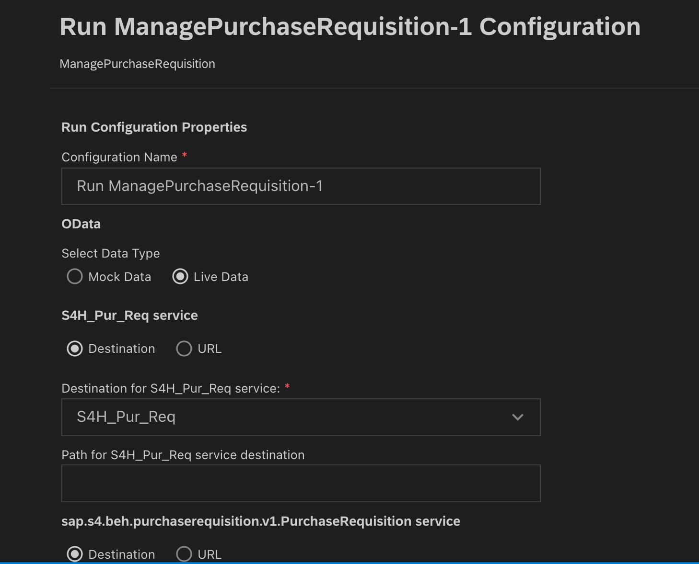
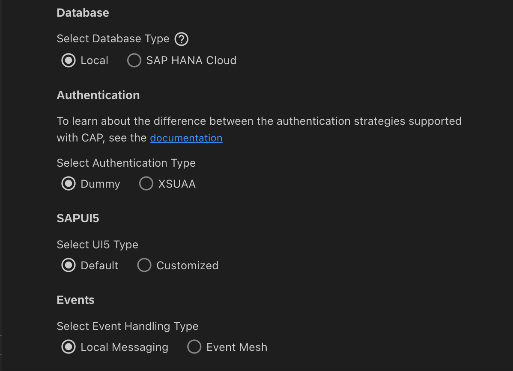
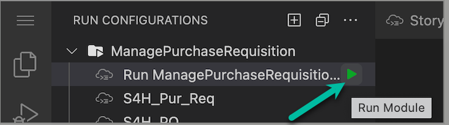
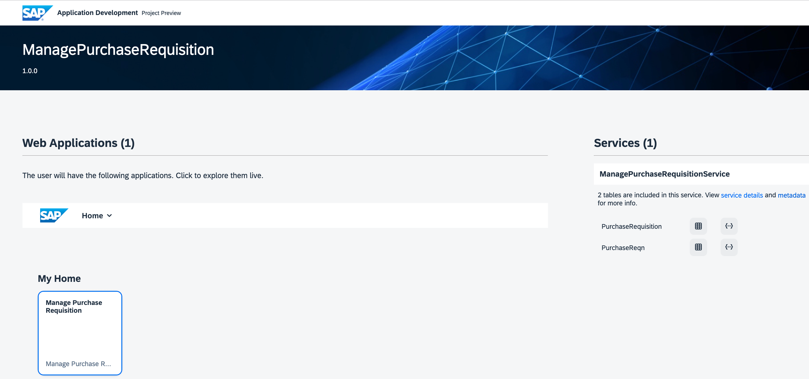
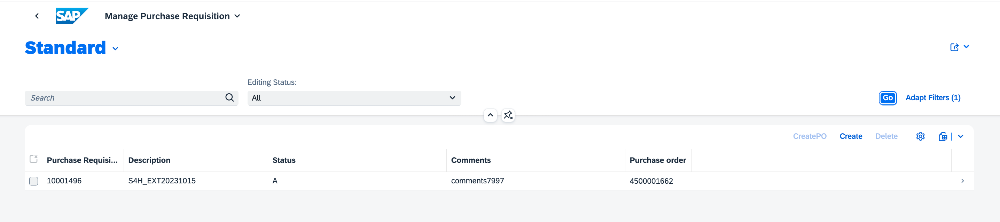
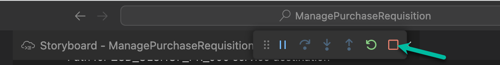
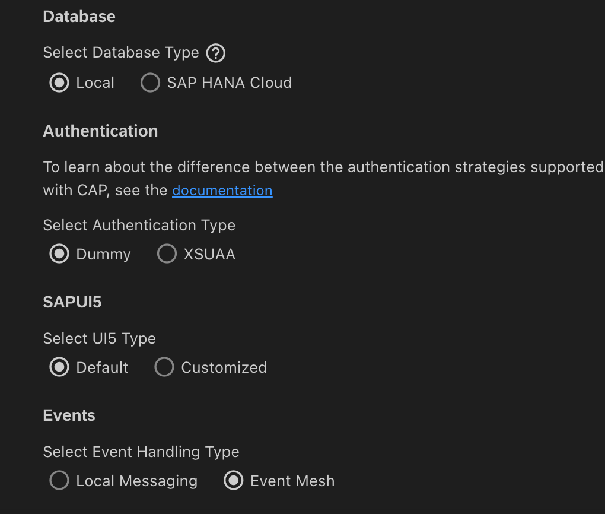
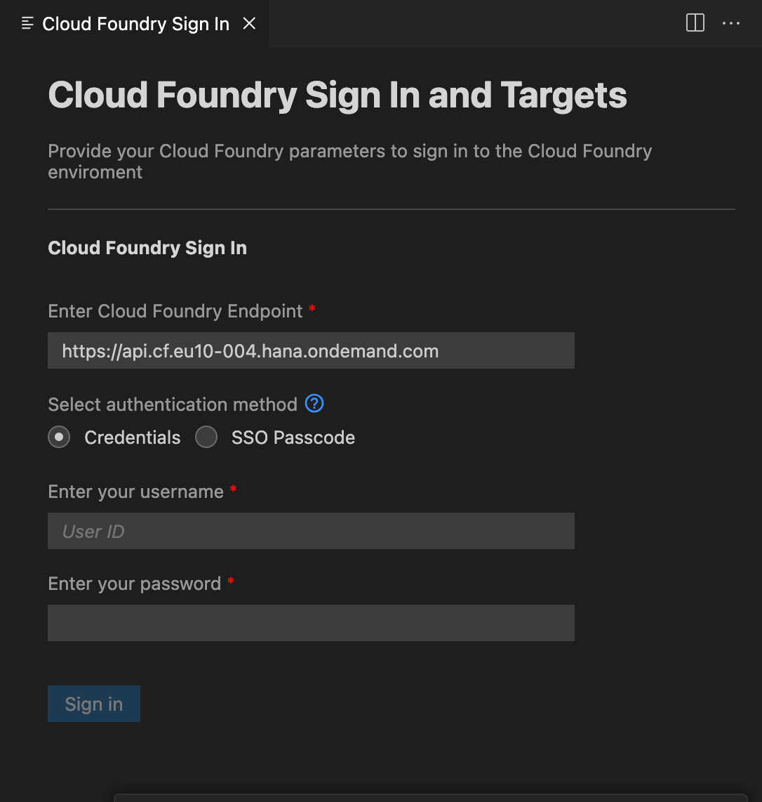
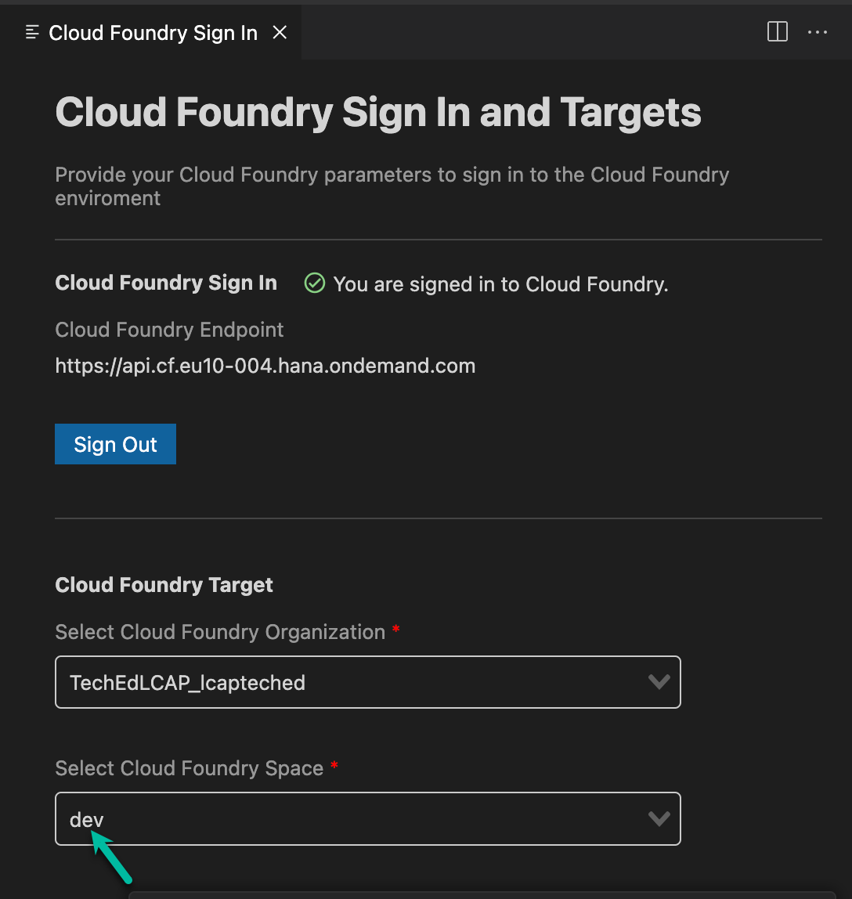

# Test Application with Sample Data

## Introduction

Congratulations! You now have finished a first version of your application. In this section, you will perform a quick test run using the  in SAP Business Application Studio with sample data to try out the application.

## Preview SAP BTP Application

1. Make sure you have opened **SAP Business Application Studio** and navigate to the **Storyboard**.

2. Choose the **[Run Configuration](https://help.sap.com/docs/bas/developing-business-applications-using-productivity-tools/testing-applications?q=run%20and%20debug)** button from the left panel of your screen.

3. Set the configuration in OData to run with "Live" data and select the destination for "S4H_Pur_Req service" as "S4H_Pur_Req".

4. Scroll to the bottom of the screen, ensure "Events" is set to local.

5. Run the application from the green icon on right side of Run COnfiguration name.

6. A new browser tab will open showing your application.

7. Choose a tile to try out your app. Click on `Manage Purchase Requisition` app
8. Click `Go` button to display the sample data

9. Make sure you exit the preview mode after your test is finished by clicking **Stop Icon** in SAP BAS.

# Run with Event Mesh
1. Go back to run configurations and set the "Events" to *Event Mesh*.

2. It will ask for CF login. Provide your username and password to login.

3. Select the Devspace as "dev".

4. Click on the link below "Events" for one time local setup for event processing. This step is requied only once for every project.

5. Create data using S/4 preview app and repeat steps 5 to 9 from the above section to view the data created by live events.
> Note: Please delete the sample data before using the Event Mesh option.
