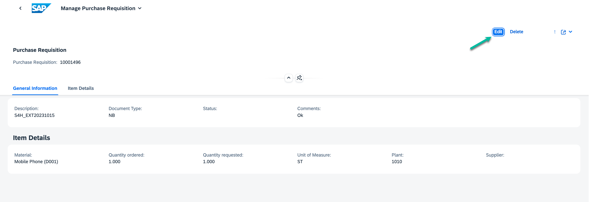
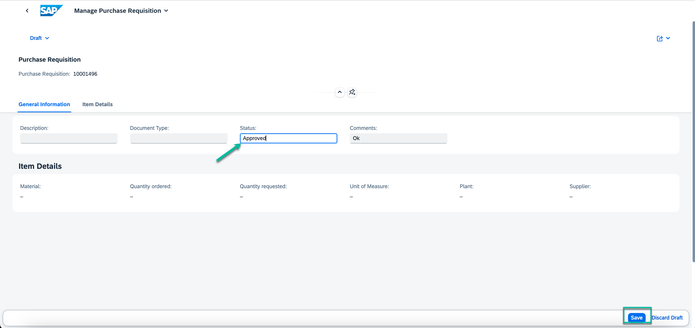
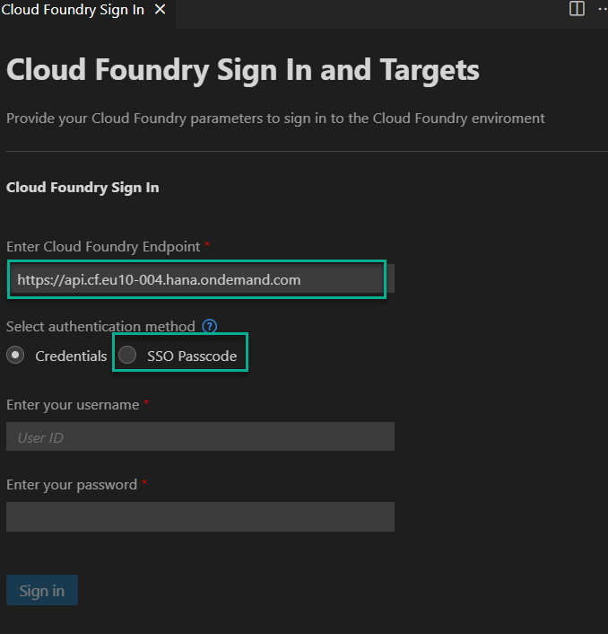
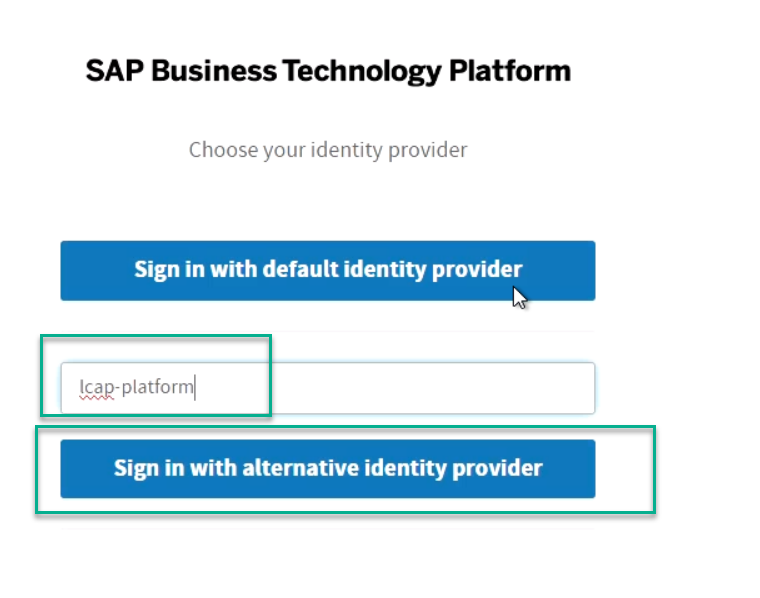
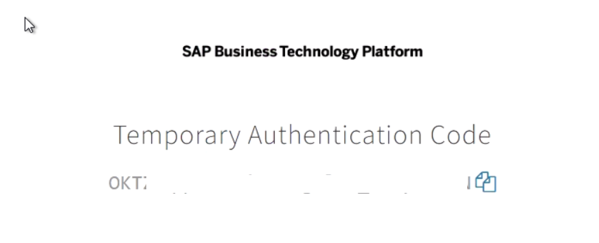
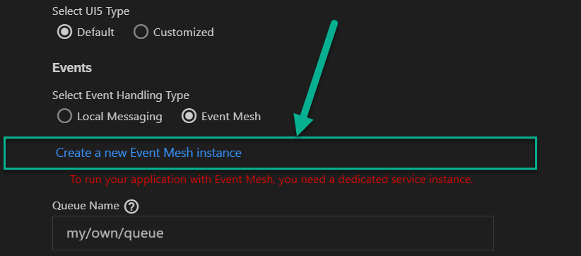

# Preview and Test your Full-Stack Application

## Introduction

Congratulations! You now have finished a working version of your application. In this section, you will perform a quick test run using the in SAP Business Application Studio with sample data to try out the application.

## Preview SAP BTP Application

1. Make sure you are on the **Storyboard**.

2. Choose the **[Run Configuration](https://help.sap.com/docs/bas/developing-business-applications-using-productivity-tools/testing-applications?q=run%20and%20debug)** button from the left panel of your screen.

3. Set the configuration in OData to run with "Live" data and select the destination for "S4H_Pur_Req service" as "S4H_Pur_Req". This is to ensure that you get the data from Live S/4HANA on-premise system.

4. Scroll to the bottom of the screen, ensure "Events" is set to local. This will enable us to test the application locally with sample data.

5. Run the application from the green icon on right side of Run Configuration name.

6. A new browser tab will open showing your application.

7. Choose a tile to try out your app. Click on `Manage Purchase Requisition` app
8. Click `Go` button to display the sample data

9. Navigate to details of the Purchase Requisition.

10. Click on *Edit* from the top right corner to review the Purchase Requisition and update the status to "Approved" or "Rejected". Save.

    
11. Make sure you exit the preview mode after your test is finished by clicking **Stop Icon** in SAP Build Code.

# Run with Event Mesh

1. Go back to run configurations and set the "Events" to *Event Mesh*. This will enable the project to test events in SAP Build Code. You will be able to recieve events from the connected S/4HANA OP system. 

2. It will ask for CF login. Make sure that the Cloud Foundry endpoint is  "https://api.cf.eu10-004.hana.ondemand.com". Now, click on SSO Passcode.

3. Next, provide the value 'lcap-platform' and choose 'Sign in with Alternative Identity Provider'

4. You will get another page with the passcode. Copy this passcode in to the CF panel and log in.

6. Once you are logged in, select the Org as 'TechEdLCAP_lcapteched' and Devspace as 'dev'.

7. Click on the link below "Create a new Event Mesh Instance" to create a one-time local setup for event processing. This step is required only once for every project.

This will automatically create the Event Mesh Client and Queue for local testing. Refer to the details of the setup [here](../../../buildcode/exercises/ex6/appendix.md).

5. Create data using **[S/4 preview app](https://github.com/SAP-samples/teched2023-AD267/tree/main/exercises/rap/exercises/ex3#exercise-36-check-your-preview-application)** (open in new tab) and repeat steps 5 to 9 from the above section to view the data created by live events.
> Note: This data is temporarily persisted and will not be available if you rerun your application.

