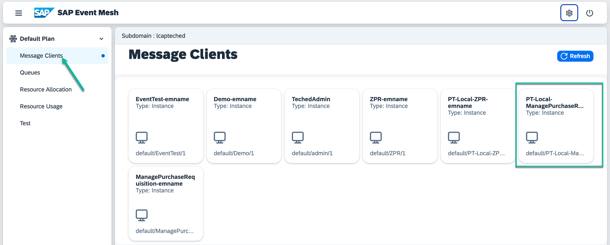

# Event Configuration #

** SAP Business Technology Platform Event Mesh **

- Goto Event Mesh application [Event Mesh](https://lcapteched.enterprise-messaging.cfapps.eu10.hana.ondemand.com/#/message_clients)
- Review the Message Client. You will see a local client and queue created automatically as shown below

  
For general information on Event mesh setup, you may refer to [Event Mesh Help Page](https://help.sap.com/docs/event-mesh/event-mesh/what-is-sap-event-mesh)

**S/4HANA On-Premise**
Configurations used in this exercise:
- Goto *SPRO*

- Manage Channel and Parameter. To create a channel you need to use the service key from event messaging instance on SAP BTP.
  [Create Channel](https://help.sap.com/docs/SAP_S4HANA_ON-PREMISE/810dfd34f2cc4f39aa8d946b5204fd9c/bc6cffca0b894d17a171549ccb16e679.html?locale=de-DEversion%3D1809.002)

- View Outbound Bindings. Here you specify which event you want to listen to. We have used "Purchase Requisition Created".

For Business Events setup, refer to [Managing Channel](https://help.sap.com/docs/SAP_S4HANA_ON-PREMISE/810dfd34f2cc4f39aa8d946b5204fd9c/dbaac652c4c941eea383a2e7f954443d.html?locale=de-DEversion%3D1809.002)
