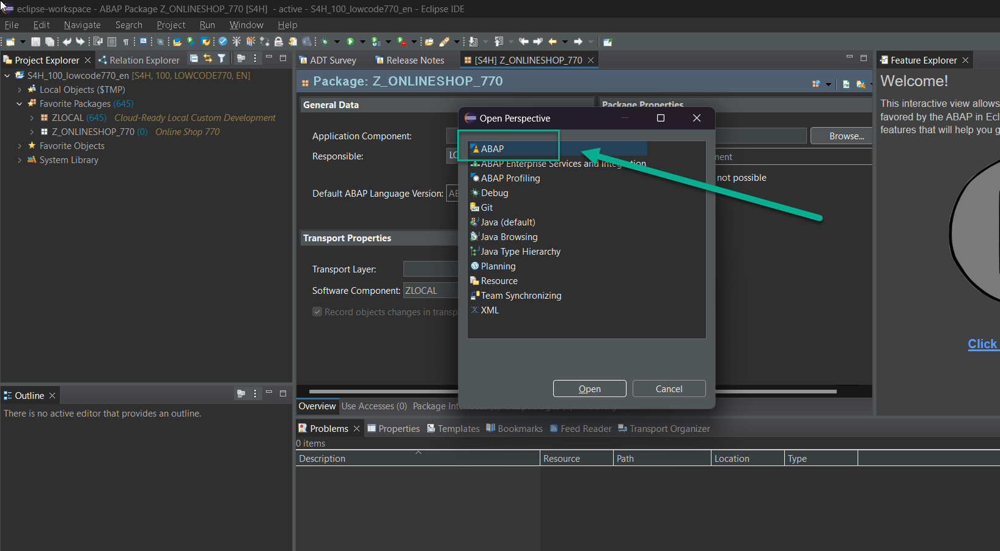

# Preparation

Let's start the exercise and see whether everything is ready to go.
Please make sure you have all the necessary prerequisites listed below. If not, please raise your voice during the meeting so that we can assist you early in the session. You will use Eclipse and ADT in the next exercise.

## Prerequisites

1.For this exercise you will need two sets of users - one for ABAP and one for SAP Build Code. You can find the list of users here - (https://github.com/SAP-samples/teched2023-AD267/blob/main/exercises/ex0/images/AD267_Users.xlsx) . Users are assigned according to your seat in the hands-on session. In case of confusion, please reach out to one of the moderators.

2. Check your access to ABAP Development Tools (ADT). To do this, open Eclipse. Click on Window -> Perspective -> Open Perspective -> Other and choose ABAP.

3. Log on to the SAP Build Lobby https://lcapteched.eu10.build.cloud.sap/lobby using a browser, preferably Google Chrome. Use the SAP Build Code user credentials provided to you. You will use it in part 2 of the exercise when building the CAP application.

4. **In almost every chapter of this tutorial there is a reference to a number ###, so a 3-digit number. Make sure that this number was assigned to you by the moderators/speakers of this course. Please remember it well.** It is important as we will use these numbers, where every user has a different one, to create different names for applications and other artifacts. As we will deploy all the artifacts to the same Business Technology Platform account, it is important that they all differ in the names and identifiers, so there are no clashes.

5. **If you don't have access to ADT (Eclipse) or the lobby with your username and password or if you don't know your number, please let the speakers know.**

Continue to - [the ABAP part](../rap/README.md) 
