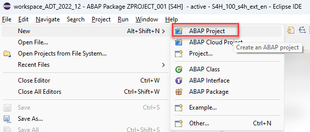
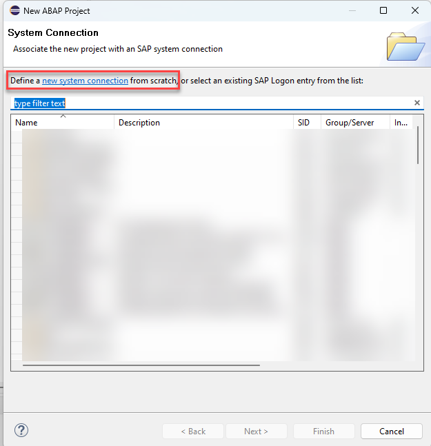
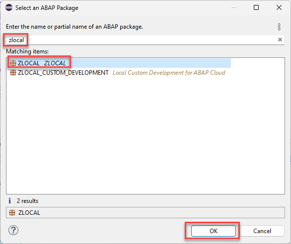

# How to connect to an SAP S/4HANA on-premise or private cloud system 

This document describes how to create an **ABAP project** to connect to an SAP S/4HANA on-premise or private cloud system.  

1. In Eclipse, click on  **File > New > ABAP Project**.

   

2. If the *System Connection* dialog is displayed, click on the link **new system connection**. If not, continue to step 3.  

   

3. In the *Connection Settings* dialog, from the connection type dropdown list, choose **Custom Application Server**.  
   
   Then, enter the following connection information (The IP address of the application server is provided by the instructors)
   - System ID: S4H
   - Application Server: 54.157.108.98
   - Instance Number: 00
  
4. Make sure the **Activate Secure Network Communication (SNC)** checkbox is not selected.
5. Click **Next**.
    

   

6. In the *Logon to System* dialog, enter the following data. You will be using the ABAP user given to you by the instructors.
    
   - Client: 100
   - User: lowcode###
   - Password: Abcd###!$
   - Language: EN

7. Press **Next**.

   
   
8. In the *Project Name* dialog, leave the default value proposed by ADT.
  
   

9. Press **Finish**.   

10. Add `ZLOCAL` to your favorites packages.  

   - In the Project Explorer, expand your newly created project.
   - Right-click on the folder **Favorite Packages**, and select **Add Package**.    

     
   
   - Search for `ZLOCAL`. Select the entry, and press **OK**.   
   
    
   

Continue to - [Exercise 1: Create an ABAP Package](../ex1/README.md) 
